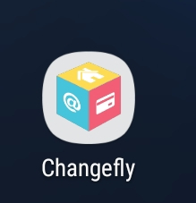

# changefly_code_challenge

A ChangeFly Code Challenge in Flutter.

Result:
 

This Flutter App has 4 different Launch Screens (or Splash Screens)
each with different styles

LaunchScreen1: Static image

LaunchScreen2: gif 

LaunchScreen3: `FadeInImage()`

LaunchScreen4: Animations + `FadeInImage()`

and ends with a Home screen.

## main.dart

In the `main.dart` file there is a `Stateful` widget and in its `build`
function it returns a `MaterialApp`. Within the `MaterialApp` properties
we use the the `routes:` to produce named routes to navigate through each
of the launch screens.

    void main(){...}
    
    class ChangeflyApp extends StatefulWidget {...}
    
    class _ChangeflyAppState extends State<ChangeflyApp> {
      @override
      Widget build(BuildContext context) {
        return MaterialApp(
        ...
            routes: {
                '/': (BuildContext context) => LaunchScreen1(),
                '/LaunchScreen2': (BuildContext context) => LaunchScreen2(),
                '/LaunchScreen3': (BuildContext context) => LaunchScreen3(),
                '/LaunchScreen4': (BuildContext context) => LaunchScreen4(),
                '/HomeScreen': (BuildContext context) => HomeScreen(),
              },

The forward slash `'/'` string is considered the initial route. Then
named routes for each launch screen and the home screen.

Also for error handling I used `onUnknownRoute:` just in case an error
happens when navigating to each route.

    onUnknownRoute: (RouteSettings setting) {
            return MaterialPageRoute(
              builder: (BuildContext context) => HomeScreen(),
            );
          },

## launch_screen1.dart

In this file I start off with a `Stateful` widget and it's state class
`initState()` is used to asynchronously start the `startTime()` function
and in it we have the `Duration` method which will expire `LaunchScreen1`
in 3 seconds and returns `Timer(_duration, _navigationPage)`, a count-down 
timer that ends the `LaunchScreen1` class and navigates to `/LaunchScreen2`
using `_navigationPage` function as a reference which uses the named route.

The following code is what gives it the Launch Screen (or Splash Screen)
effect:

    @override
      void initState() {
        startTime();
        super.initState();
      }
    
      startTime() async {
        var _duration = new Duration(seconds: 3);
        return new Timer(_duration, _navigationPage);
      }
    
      void _navigationPage() {
        Navigator.of(context).pushReplacementNamed('/LaunchScreen2');
      }

Customizing the `build` function is what gives each Launch screen
its unique style. In the `build` function, it returns a `Scaffold`
with `body: Center` and a `child: Column` then in its `childern:`
property I give it 2 images using `Image.asset()`widget.

The following code is what gives `LaunchScreen1` its style of a
static image launch screen.

    @override
      Widget build(BuildContext context) {
        return new Scaffold(
          body: Center(
            child: Column(
              mainAxisAlignment: MainAxisAlignment.center,
              children: <Widget>[
                Image.asset(
                  'assets/changefly_cube.png',
                  scale: 4.0,
                ),
                Image.asset(
                  'assets/changefly_name.png',
                  scale: 2.5,
                ),
              ],
            ),
          ),
        );
      }

For Decoration Purposes, I scaled the images to a smaller size
with `scale:` to give it a better look.

## launch_screen2.dart

In `launch_screen2.dart` file, just as `launch_screen1.dart` file,
it starts with the same code in its State class but its `Duration`
method is different with `Duration(milliseconds: 1800)` making this
launch screen shorter. As well as its named route is different which
will lead to `/LaunchScreen3`

    @override
      void initState() {
        startTime();
        super.initState();
      }
    
      startTime() async {
        var _duration = new Duration(milliseconds: 1800);
        return new Timer(_duration, _navigationPage);
      }
    
      void _navigationPage() {
        Navigator.of(context).pushReplacementNamed('/LaunchScreen3');
      }

In its `build` function, it has a similar structure to `Launchscreen1`
but instead of using images I used a `.gif` file. Produced by 
screen recording the [Changefly](https://www.changefly.com/) website
using [Snagit](https://www.techsmith.com/screen-capture.html) then
using [Adobe Premiere Pro](https://www.adobe.com/products/premiere.html)
to convert the `.mp4` file to a high quality `.gif` file then added
into my assets folder.

    @override
      Widget build(BuildContext context) {
        return new Scaffold(
          body: Center(
            child: Column(
              mainAxisAlignment: MainAxisAlignment.center,
              children: <Widget>[
                Image.asset('assets/changefly.gif',),
                Padding(padding: EdgeInsets.all(25.0))
              ],
            ),
          ),
        );
      }

For Decoration Purposes, `Padding` was used to move the gif asset
towards the center since the recording was not symmetrically
centered making the animation in the gif asset seem more at the
bottom.

## launch_screen3.dart

Same launch screen effect with the difference in `Duration(seconds: 2)` 
and different named route to lead to `/LaunchScreen4`.

    @override
      void initState() {
        startTime();
        super.initState();
      }
    
      startTime() async {
        var _duration = new Duration(seconds: 2);
        return new Timer(_duration, _navigationPage);
      }
    
      void _navigationPage() {
        Navigator.of(context).pushReplacementNamed('/LaunchScreen4');
      }
      
In its `build` function, it has a similar structure to the launch screens
before but the `Center` widget is now inside the `Column` widget in order to
center the `FadeInImage()` widget to the middle of the screen. `FadeInImage()`
widget is an Image that shows a placeholder image while the target image 
is loading, then fades in the new image when it loads. So in this code the
Changefly cube is the placeholder image that fades out then the Changefly 
name fades in. 

    @override
      Widget build(BuildContext context) {
        return new Scaffold(
          body: Column(
            mainAxisAlignment: MainAxisAlignment.center,
            children: <Widget>[
              Center(
                child: FadeInImage(
                  placeholder: AssetImage('assets/changefly_cube.png'),
                  image: AssetImage('assets/changefly_name.png'),
                  height: 200.0,
                  width: 200.0,
                  fadeOutDuration: Duration(milliseconds: 800),
                ),
              )
            ],
          ),
        );
      }
      
For Decoration Purposes, in `FadeInImage()` widgets's properties I've added
`height:` and `width:` to scale the images to a smaller size. Also
`fadeOutDuration:` was used to fade out the placeholder image with a duration
of 800 milliseconds.

## launch_screen4.dart

In the `launch_screen4.dart` file we still have the same launch screen effect
with the difference in `Duration(seconds: 3)` and navigates to `/HomeScreen` 
but now not only with the `FadeInImage()` widget but also with animations
added.
Starting with a `Stateful` widget, the State class has `TickerProviderStateMixin`
for the multiple of `AnimationController` in the class.

    class _LaunchScreen4State extends State<LaunchScreen4>
        with TickerProviderStateMixin {

In the State class we will have:
* 3 `Animation<double>` variables
* 3 `AnimationController` variables

      Animation<double> cubeTopAnimation;
      AnimationController cubeTopController;
      Animation<double> cubeRightAnimation;
      AnimationController cubeRightController;
      Animation<double> cubeLeftAnimation;
      AnimationController cubeLeftController;
    
* 3 `Tween()` animations with 3 `CurvedAnimation()` classes in the `initState()`

    
      @override
      void initState() {
        super.initState();
        startTime();  
        /**
        * With `AnimationController()` we can use the `duration:` property
        * to control the durations of the animation
        **/
        cubeTopController = AnimationController(
          duration: Duration(  
            milliseconds: 1500,
          ),
          /**
          * According to the Flutter docs:
          * To create an AnimationController in a class that uses this
          * (TickerProviderStateMixin) mixin, pass `vsync: this` to the 
          * animation controller constructor whenever you create a new 
          * animation controller.
          **/
          vsync: this,  
        );
        
        /**
        * `Tween()` is a linear interpolation between a beginning and 
        * ending value. Values here make the images slide from outside
        * screen into the center.
        **/    
        cubeTopAnimation = Tween(
          begin: -400.0,
          end: 0.0,
        )
        /**
        * After tween we use the `animate` method so we can add the
        * `CurvedAnimation()` class in it, giving the animation a
        * non-linear curve, we can access ohter types of curves in the
        * `curve:` property, here we use `Curves.bounceInOut` to give
        * the animation a bouncing effect. `parent:` is used to access
        * the AnimationsController's duration property.
        **/
        .animate(CurvedAnimation(
          parent: cubeTopController,
          curve: Curves.bounceInOut,
        ));
    
        cubeRightController = AnimationController(
          duration: Duration(
            milliseconds: 1500,
          ),
          vsync: this,
        );
    
        cubeRightAnimation = Tween(
          begin: -400.0,
          end: 0.0,
        ).animate(CurvedAnimation(
          parent: cubeRightController,
          curve: Curves.bounceInOut,
        ));
    
        cubeLeftController = AnimationController(
          duration: Duration(
            milliseconds: 1500,
          ),
          vsync: this,
        );
    
        cubeLeftAnimation = Tween(
          begin: -400.0,
          end: 0.0,
        ).animate(CurvedAnimation(
          parent: cubeLeftController,
          curve: Curves.bounceInOut,
        ));
        
        /**
        * Accessing the `AnimationController` method, I use `forward()`
        * to play the animation towards the `end:`
        **/
        cubeTopController.forward();
        cubeRightController.forward();
        cubeLeftController.forward();
      }

* 3 `AnimatedBuilder()` to build the animations
* 3 `Positioned()` widgets

    
      /**
      * I Customized 3 widgets so that the `build` function can be easier 
      * to read.
      * In the `AnimatedBulder()` property, `builder:`, I used the `Positioned()`
      * widget in order to position the differnt cube images with it's `top:`,
      * `right:` and `left:` properties.
      **/
      Widget buildCubeTopAnimation() {
        return AnimatedBuilder(
          animation: cubeTopAnimation,
          builder: (context, child) {
            return Positioned(
              child: child,
              top: cubeTopAnimation.value, // `double` value that has the `begin:` and `end:` values
              right: 0.0,
              left: 0.0,
            );
          },
          child: Image.asset('assets/changefly_cube_top.png'),
        );
      }
    
      Widget buildCubeRightAnimation() {
        return AnimatedBuilder(
          animation: cubeRightAnimation,
          builder: (context, child) {
            return Positioned(
              child: child,
              top: 0.0,
              right: cubeRightAnimation.value,
              left: 0.0,
            );
          },
          child: Image.asset('assets/changefly_cube_right.png'),
        );
      }
    
      Widget buildCubeLeftAnimation() {
        return AnimatedBuilder(
          animation: cubeLeftAnimation,
          builder: (context, child) {
            return Positioned(
              child: child,
              top: 0.0,
              right: 0.0,
              left: cubeLeftAnimation.value,
            );
          },
          child: Image.asset('assets/changefly_cube_left.png'),
        );
      }

Finally we move into the `build` function where it will show the animations
and the `FadeInImage()`. Similar structure to the launch screens before, 
the `build` returns a `Scaffold()` with a `body:` of `Center()` and its
`child:` is a `Column()`. 

              ...
              mainAxisAlignment: MainAxisAlignment.center,
              children: <Widget>[
              /**
              * This empty container widget is used to push the animations 
              * and `FadeInImage()` more towards the center since its in a 
              * `Column()` widget
              **/
                Container(
                  height: 150.0,
                ),
                /**
                * The `Stack()` widget is used so that the images/animations 
                * can overlay each other. 
                * We then add our Custimized widgets and also an empty
                * `Container()` into its `children:`. The empty container is
                * used so that the images/animations can overlay the empty
                * container and not the `FadeInImage()` widget
                **/
                Stack(
                  overflow: Overflow.visible, //So that we dont get an overflow error
                  children: <Widget>[
                    buildCubeTopAnimation(),
                    buildCubeRightAnimation(),
                    buildCubeLeftAnimation(),
                    Container(
                      width: 200.0, // This value helped shrink the image
                      height: 220.0, // This value helped move the `FadeInImage()` a little lower
                    ),
                  ],
                ),
                /**
                * In the `FadeInImage()` widget, the placeholder is
                * a simple transparent image represented as a Uint8List named
                * `kTransparentImage`. To use, first install the transparent_image
                * package (https://pub.dartlang.org/packages/transparent_image#-installing-tab-)
                * into your `pubspec.yaml` file. It's a memomry image so the 
                * `MemoryImage()` widget was used.
                **/
                FadeInImage(
                  placeholder: MemoryImage(kTransparentImage),
                  image: AssetImage('assets/changefly_name1.png'),
                  height: 250.0,
                  width: 250.0,
                  //So that the Changefly name comes a moment after the animations
                  fadeOutDuration: Duration(milliseconds: 1300),
                  // Puts the image closer to the animations
                  alignment: Alignment.topCenter,
                ),
              ],
              ...

## homescreen.dart

Finally in the `HomeScreen` there's a `Stateless` widget with one customized
`DecorationImage` widget, used for making the Changfly cube into a faded
background image.

    DecorationImage _buildBackgroundImage() {
        return DecorationImage(
          fit: BoxFit.scaleDown,
          colorFilter: ColorFilter.mode(
            Colors.white.withOpacity(0.1),
            BlendMode.dstATop,
          ),
          image: AssetImage('assets/changefly_cube.png'),
        );
      }

For fun, in the `build` function I added an `Appbar()` with the `title:`
being the image of the Changefly name, a `leading:` icon of the Changefly
cube and a `actions:` icon of the Changefly cube also.

      Widget build(BuildContext context) {
        return Scaffold(
          appBar: AppBar(
            title: Image.asset(
              'assets/changefly_name.png',
              scale: 3.5,
            ),
            centerTitle: true,
            leading: Image.asset('assets/changefly_cube.png'),
            actions: <Widget>[
              Image.asset('assets/changefly_cube.png'),
            ],
          ),
          body: Container(
            decoration: BoxDecoration(
              image: _buildBackgroundImage(), // For the background image
            ),
          ),
         );
      }
      
## Bonus

I changed the Flutter launcher icon to the Changefly cube, as well as the 
name under the launcher icon.

Click link for instructions to change launcher icon:
 
[flutter_launcher_icons](https://pub.dartlang.org/packages/flutter_launcher_icons#-installing-tab-)
 
Click link for instructions to change launcher name:
 
[flutter_launcher_name](https://stackoverflow.com/questions/46694153/changing-the-project-name#)

For help getting started with Flutter, view the online
[documentation](https://flutter.io/).
